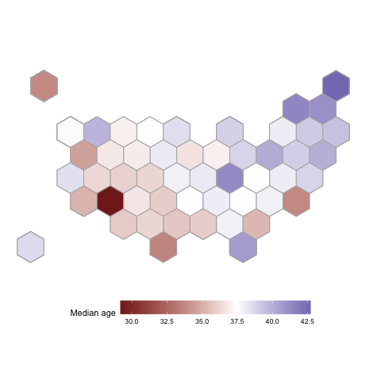

<!-- README.md is generated from README.Rmd. Please edit that file -->

```{r, include = FALSE}
knitr::opts_chunk$set(
  collapse = TRUE,
  comment = "#>",
  fig.path = "man/figures/README-",
  out.width = "100%"
)
```

# handbook

<!-- badges: start -->
[](https://github.com/heike/handbook/actions/workflows/R-CMD-check.yaml)
<!-- badges: end -->

The goal of the package `handbook` is to provide data for some infrastructure to create graphics. 

## Installation

You can install the development version of handbook like so:

``` r
remotes::install_github("heike/handbook")
```

## Example

This is a basic example which shows you how to solve a common problem:

```{r example}
# Setting up all packages for the examples
library(handbook)
library(tidyverse)
library(patchwork)
library(glue)

## basic example code
```

### Color schemes

Six sequential color schemes (`palette = 1:6, type = "seq"`) and three divergent color schemes (`palette = 1:3, type = "div"`) were implemented based on IES colors:

```{r}
scale_fill_nces
scale_colour_nces
```

#### Sequential Color Scheme

```{r echo=FALSE}
dframe <- data.frame(
  levels = 2:9
) 
dframe <- dframe %>% mutate(
  values = levels %>% purrr::map(.f = sample, size = 100, replace = TRUE),
  p = values %>% purrr::map(.f = function(x) {
    data.frame(x = factor(x)) %>%
      ggplot(aes(x = x, fill = factor(x))) +
        geom_bar() +
        scale_fill_nces(palette="ies_blues") +
        theme_bw() + 
        theme(legend.position = "none") +
        ggtitle(sprintf("%d colors", length(unique(x))))
  })
) 

(dframe$p[[1]] + dframe$p[[2]] + dframe$p[[3]])/(dframe$p[[4]] + dframe$p[[5]] + dframe$p[[6]])/
  (dframe$p[[7]] + dframe$p[[8]]) 
```

#### Divergent Color Scheme

```{r echo=FALSE}
dframe <- dframe %>% mutate(
  values = levels %>% purrr::map(.f = sample, size = 100, replace = TRUE),
  p = values %>% purrr::map(.f = function(x) {
    data.frame(x = factor(x)) %>%
      ggplot(aes(x = x, fill = factor(x))) +
      geom_bar() +
      scale_fill_nces(palette=1, type="div") +
      theme_bw() + 
      theme(legend.position = "none") +
      ggtitle(sprintf("%d colors", length(unique(x))))
  })
) 

(dframe$p[[1]] + dframe$p[[2]] + dframe$p[[3]])/(dframe$p[[4]] + dframe$p[[5]] + dframe$p[[6]])/
  (dframe$p[[7]] + dframe$p[[8]]) 
```


### Maps

The `statesmaps` object consists of polygons and hex shapes describing each state. Additionally, state names, abbreviations and fips codes are provided for linkage with data sources.

```{r maps}
head(statesmaps)
```
As an example to acquire data from the US Census Bureau we can use the code below, thanks to Kyle Walker's amazing [tidycensus](https://walker-data.com/tidycensus/articles/basic-usage.html) package:

```{r}
library(tidyverse)
library(tidycensus)
census_key <- "place your API key here"
#census_api_key(census_key)

# H012001 encodes the average houshold size
hh10 <- get_decennial(geography = "state",
                       variables = "H012001",
                       year = 2010)
map_values <- statesmaps %>% left_join(hh10, by = c("state_name" = "NAME"))
```

Once the data is joined with the mapping information, we can draw choropleth maps or hexbin maps:

```{r}
library(mapproj)
map_values %>% unnest(col=polygon) %>%
  ggplot(aes( x = long, y = lat, group = group, fill=value)) +
  geom_polygon(colour = "grey50", size=0.1) +
  #  geom_text (aes(label=id)) +
  theme_void () +
  coord_map () +
  scale_fill_gradient2("Avg. Household size", midpoint=median(hh10$value))
```

Note that only in the hexbin diagram we get to see the nation's territory with the smallest average household size: DC residents report in the 2010 census an average household size of 2.1 persons.

```{r}
map_values %>% unnest(col=hexagon) %>% 
  filter(piece == 1) %>%  # not necessary, but cleaner
  ggplot(aes( x = long, y = lat, group = group, fill=cut_by_n(value, state_abbv, n=5, type="quantile"))) +
  geom_polygon(colour = "grey50", size=0.1) + 
  theme_void () +
  coord_map () +
  scale_fill_nces("Quintiles of\nAverage Household Size", type="seq", palette="ies_blues", guide = guide_legend(reverse = TRUE) ) +
#  scale_fill_gradient2("Avg. Household size", midpoint=median(hh10$value)) +
  geom_text(aes(label = state_abbv, colour = I((value-2.495) <= 0.015)), 
            map_values %>% filter(piece == 1) %>% unnest(col=hexagon_labels)) +
  scale_colour_manual(values=c("white", "grey20")) +
  guides(colour = "none") 
```

#### Animation between hex and choropleth map

Animation between choropleth states map and hexbin showing the median age of state populations.

```{r}

```

```{r, echo=FALSE}

```
