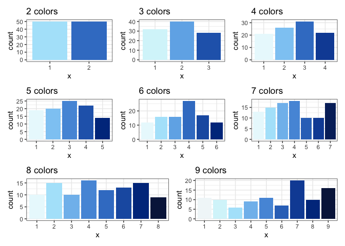
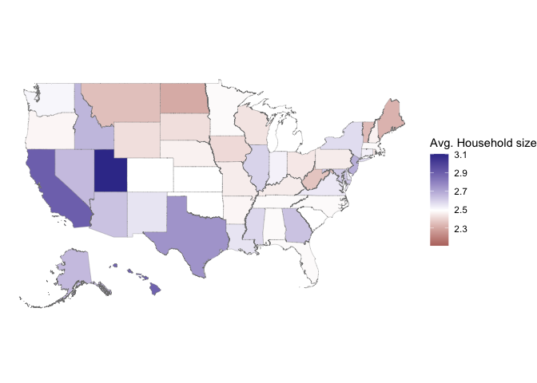

<!-- README.md is generated from README.Rmd. Please edit that file -->

# handbook

<!-- badges: start -->

[](https://github.com/heike/handbook/actions/workflows/R-CMD-check.yaml)
<!-- badges: end -->

The goal of the package `handbook` is to provide data for some
infrastructure to create graphics.

## Installation

You can install the development version of handbook like so:

``` r
remotes::install_github("heike/handbook")
```

## Example

This is a basic example which shows you how to solve a common problem:

``` r
# Setting up all packages for the examples
library(handbook)
library(tidyverse)
#> ── Attaching packages ─────────────────────────────────────── tidyverse 1.3.1 ──
#> ✔ ggplot2 3.3.6     ✔ purrr   0.3.4
#> ✔ tibble  3.1.7     ✔ dplyr   1.0.9
#> ✔ tidyr   1.2.0     ✔ stringr 1.4.0
#> ✔ readr   2.1.2     ✔ forcats 0.5.1
#> ── Conflicts ────────────────────────────────────────── tidyverse_conflicts() ──
#> ✖ dplyr::filter() masks stats::filter()
#> ✖ dplyr::lag()    masks stats::lag()
library(patchwork)
library(glue)

## basic example code
```

### Color schemes

Six sequential color schemes (`palette = 1:6, type = "seq"`) and three
divergent color schemes (`palette = 1:3, type = "div"`) were implemented
based on IES colors:

``` r
scale_fill_nces
#> function (..., type = "seq", palette = 1, direction = -1, aesthetics = "fill") 
#> {
#>     ggplot2::discrete_scale(aesthetics, "nces", nces_palette(type, 
#>         palette, direction), ...)
#> }
#> <bytecode: 0x7fd1a9700588>
#> <environment: namespace:handbook>
scale_colour_nces
#> function (..., type = "seq", palette = 1, direction = 1, aesthetics = "colour") 
#> {
#>     ggplot2::discrete_scale(aesthetics, "nces", nces_palette(type, 
#>         palette, direction), ...)
#> }
#> <bytecode: 0x7fd1a9769b30>
#> <environment: namespace:handbook>
```

#### Sequential Color Scheme

    #> Warning in choose_n(colors, n, type): chosen color palette only has 9 colors.



#### Divergent Color Scheme


### Maps

The `statesmaps` object consists of polygons and hex shapes describing
each state. Additionally, state names, abbreviations and fips codes are
provided for linkage with data sources.

``` r
head(statesmaps)
#> # A tibble: 6 × 10
#>   state_name state_abbv state_fips piece hole  group     polygon  hexagon 
#>   <chr>      <chr>      <chr>      <dbl> <lgl> <fct>     <list>   <list>  
#> 1 Alabama    AL         01             1 FALSE Alabama.1 <tibble> <tibble>
#> 2 Alabama    AL         01             2 FALSE Alabama.2 <tibble> <tibble>
#> 3 Alabama    AL         01             3 FALSE Alabama.3 <tibble> <tibble>
#> 4 Alabama    AL         01             4 FALSE Alabama.4 <tibble> <tibble>
#> 5 Alaska     AK         02             1 FALSE Alaska.1  <tibble> <tibble>
#> 6 Alaska     AK         02             2 FALSE Alaska.2  <tibble> <tibble>
#> # … with 2 more variables: hexagon_labels <list>, polygon_labels <list>
```

As an example to acquire data from the US Census Bureau we can use the
code below, thanks to Kyle Walker’s amazing
[tidycensus](https://walker-data.com/tidycensus/articles/basic-usage.html)
package:

``` r
library(tidyverse)
library(tidycensus)
census_key <- "place your API key here"
#census_api_key(census_key)

# H012001 encodes the average houshold size
hh10 <- get_decennial(geography = "state",
                       variables = "H012001",
                       year = 2010)
#> Getting data from the 2010 decennial Census
#> Using Census Summary File 1
map_values <- statesmaps %>% left_join(hh10, by = c("state_name" = "NAME"))
```

Once the data is joined with the mapping information, we can draw
choropleth maps or hexbin maps:

``` r
library(mapproj)
#> Loading required package: maps
#> 
#> Attaching package: 'maps'
#> The following object is masked from 'package:purrr':
#> 
#>     map
map_values %>% unnest(col=polygon) %>%
  ggplot(aes( x = long, y = lat, group = group, fill=value)) +
  geom_polygon(colour = "grey50", size=0.1) +
  #  geom_text (aes(label=id)) +
  theme_void () +
  coord_map () +
  scale_fill_gradient2("Avg. Household size", midpoint=median(hh10$value))
```



Note that only in the hexbin diagram we get to see the nation’s
territory with the smallest average household size: DC residents report
in the 2010 census an average household size of 2.1 persons.

``` r
map_values %>% unnest(col=hexagon) %>% 
  filter(piece == 1) %>%  # not necessary, but cleaner
  ggplot(aes( x = long, y = lat, group = group, fill=cut_by_n(value, state_abbv, n=5, type="quantile"))) +
  geom_polygon(colour = "grey50", size=0.1) + 
  theme_void () +
  coord_map () +
  scale_fill_nces("Quintiles of\nAverage Household Size", type="div", palette=2) +
#  scale_fill_gradient2("Avg. Household size", midpoint=median(hh10$value)) +
  geom_text(aes(label = state_abbv, colour = I(abs(value-2.495) <= 0.015)), 
            map_values %>% filter(piece == 1) %>% unnest(col=hexagon_labels)) +
  scale_colour_manual(values=c("white", "grey50")) +
  guides(colour = "none") 
```


#### Animation between hex and choropleth map

Animation between choropleth states map and hexbin showing the median
age of state populations.


